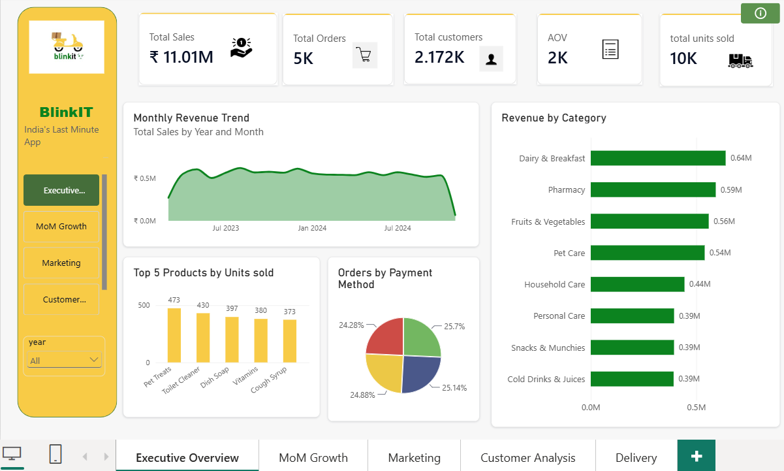
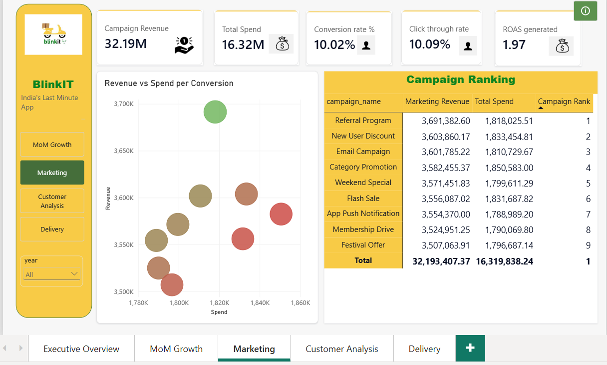
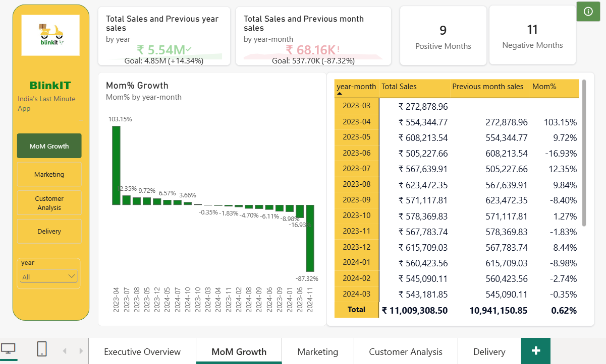
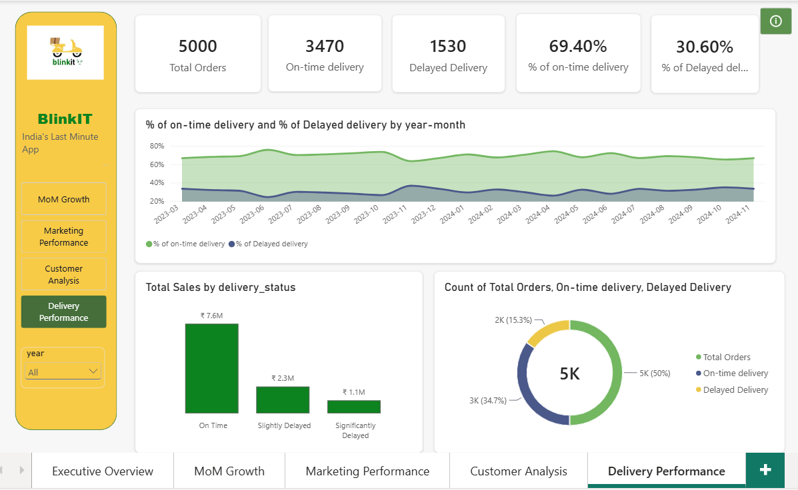
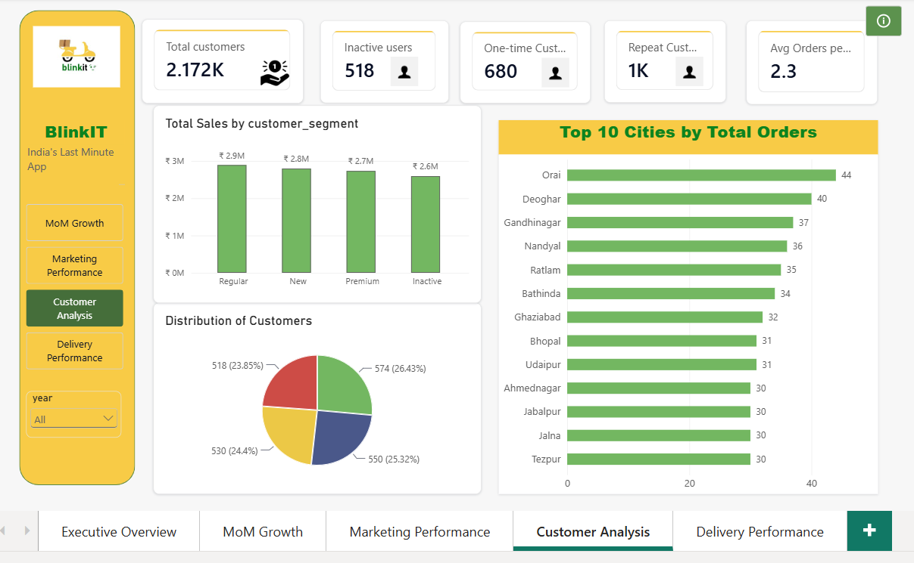

# BlinkIT-sales-dashboard
Power BI dashboard analyzing BlinkIT sales, marketing, and delivery performance

## 📌 Overview
An end-to-end Power BI analytics dashboard analyzing BlinkIT's (India's last-minute delivery app) sales, customer behavior, delivery performance, and marketing campaign efficiency — built to simulate how a Data/BI Analyst would report on business health to leadership and identify actionable opportunities.

## 🎯 Business Questions Answered
- How is revenue trending month-over-month, and where are the biggest growth/decline periods?
- Which customer segments and cities drive the most orders?
- Which marketing campaigns deliver the best ROAS, and which are underperforming?
- How reliable is delivery performance, and is it improving or declining over time?

## 🛠️ Tools & Skills Used
- **SQL** — data extraction and analysis (joins, CTEs, window functions: `LAG`, `RANK`)
- **Power BI** — data modeling, DAX measures, interactive multi-page dashboard design
- **Power Query** — data cleaning and transformation
- **DAX** — KPI calculations (Revenue, AOV, MoM Growth %, ROAS, On-Time Delivery %)

## 📊 Dashboard Pages
1. **Executive Overview** — high-level KPIs, revenue trend, category performance, payment methods
2. **MoM Growth** — month-over-month revenue growth analysis with goal tracking
3. **Marketing** — campaign ranking, ROAS analysis, revenue-vs-spend efficiency (scatter plot with ROAS-based sizing/color)
4. **Customer Analysis** — customer segmentation, retention/inactivity, top cities by orders
5. **Delivery Performance** — on-time vs delayed delivery trends, delivery status breakdown

## 💡 Key Insights
- Total revenue generated was ₹11M, with Pet Treats as the top-selling product by unit volume and Dairy & Breakfast contributing the highest revenue by category.
- Revenue stayed relatively stable through the year, with a sharp decline in November 2024.
- The Referral Program was the top-performing marketing campaign by revenue, followed by New User Discount, with an average ROAS of ~2x across campaigns.
- 24% of the customer base is inactive, representing a re-engagement opportunity.
- Regular customers contribute the highest revenue among all customer segments.
- Total sales grew ~14% year-over-year, though MoM growth showed a sharp drop in November 2024, flagging it as a period worth investigating further.
- 69% of orders were delivered on time, and on-time deliveries generated the highest sales (~₹7.8M) among all delivery statuses.
## 🖼️ Screenshots

## 📂 Data Source
Sample e-commerce/retail dataset (multiple relational tables: orders, customers, products, delivery performance) sourced for portfolio practice. Data was cleaned, modeled, and joined independently to build the analysis layer and dashboard.
